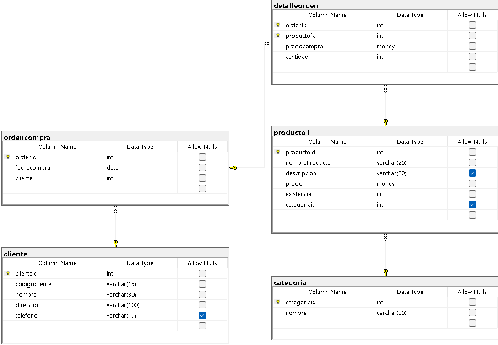

# Ejercio de Creacion de base de datos con SQL-LDD

``` SQL 
-- Creacion de la Base de Datos tienda1
-- Crea la Base de Datos tienda1
create database tienda1;

-- Utilizar una base de datos
use tienda1;

-- SQL-LDD
-- Crear la tabla categoria
create table categoria(
categoriaid int not null,
nombre varchar (20) not null,
constraint pk_categoria
primary key (categoriaid),
constraint unico_nombre
unique(nombre)
);

-- SQL-LMD
-- Agregar registros a la tabla categoria

insert into categoria
values(1,'Carnes Frias');

insert into categoria(categoriaid,nombre)
values (2,'Liena Blanca');

insert into categoria(nombre,categoriaid)
values ('Vinos y licores',3);

insert into categoria
values (4, 'ropa'),
		(5,'Dulces'),
		(6,'Lacteos');
        
insert into categoria (nombre, categoriaid)
values ('Panaderia', 7),
		('Zapateria',8),
		('Jugueteria',9);


create table producto1(
productoid int not null,
nombreProducto varchar (20) not null,
descripcion varchar (80) null,
precio money not null,
existencia int not null,
categoriaid int null,
constraint pk_producto1
primary key (productoid),
constraint unico_descripcion 
unique (nombreProducto)
);

Select * from categoria;
-- order by categoriaid asc;

--Creacion tabla cliente
create table cliente (
clienteid int not null identity(1,1),
codigocliente varchar (15) not null,
nombre varchar(30) not null,
direccion varchar (100) not null,
telefono varchar (19),
--
constraint pk_cliente
primary key (clienteid),
--
constraint unico_codigocliente
unique(codigocliente),
);


--Creacion tabala detalle orden

create table detalleorden(
ordenfk int not null,
productofk int not null,
preciocompra money not null,
cantidad int not null,
--
constraint pk_detalleorden
primary key (ordenfk,productofk),
--
constraint chk_preciocompra
check(preciocompra>0.0 and preciocompra <= 20000),
check (cantidad>0),
constraint fk_detalleorden_producto
foreign key (productofk)
references producto1(productoid),
);

--CREACION TABAL ORDEN DE COMPRA

CREATE TABLE ordencompra(
ordenid int not null identity (1,1),
fechacompra date not null,
cliente int not null,
--
constraint pk_ordencompra
primary key(ordenid),
--
constraint fk_ordencompra_cliente
foreign key (cliente)
references cliente(clienteid)
);

alter table detalleorden
add constraint fk_detalleorden_ordencompra
foreign key (ordenfk)
references ordencompra (ordenid);


```
## Diagrama resultante

